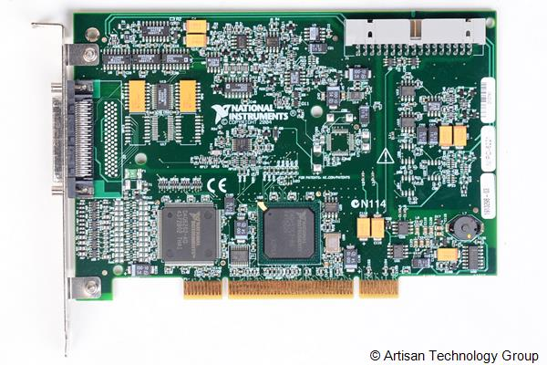

# README pour l'utilisation de la carte NI-PCI 6221

## Introduction

La carte NI-PCI 6221 est une carte d'acquisition de données multifonctions conçue par National Instruments. Elle offre une combinaison de fonctionnalités d'entrée et de sortie analogiques et numériques, rendant ce matériel adapté à une grande variété d'applications industrielles, scientifiques, et de recherche.

<p align="center">
    
</p>


## Prérequis

- Un PC avec un slot PCI disponible
- Système d'exploitation supporté (Windows, Linux)
- Logiciel NI-DAQmx pour le contrôle des pilotes et l'interface de programmation

## Installation Matérielle

1. **Éteignez** votre ordinateur et débranchez-le de la source d'alimentation.
2. **Retirez** le couvercle du PC pour accéder aux slots PCI.
3. **Insérez** la carte NI-PCI 6221 dans un slot PCI libre, en appliquant une pression uniforme pour s'assurer qu'elle est bien connectée.
4. **Replacez** le couvercle du PC et reconnectez l'alimentation.

## Configuration Logicielle

### Installation de NI-DAQmx

1. **Téléchargez** le dernier pilote <a href="https://www.ni.com/fr/support/downloads/drivers/download.ni-daq-mx.html#521556">NI-DAQmx</a>  depuis le site de National Instruments.


2. **Exécutez** le programme d'installation et suivez les instructions à l'écran.
3. **Redémarrez** votre ordinateur après l'installation pour que les changements prennent effet.

## Configuration du matériel

1. **Ouvrez** l'application NI Measurement & Automation Explorer (NI MAX). Sous l'arborescence "Devices and Interfaces", vous devriez voir la carte NI-PCI 6221 listée.

<p align="center">
    
</p>

2. **Cliquez** droit sur le périphérique : NI-PCI-6221 "Dev1" et sélectionnez "Test Panel" pour vérifier le fonctionnement de la carte.

<p align="center">
  
</p>


### Vérification des photodiodes et de la lampe à arc au Xénon

3. **Cliquez** sur Entrée analogique et vérifiez que les données entrées sont correctes :

<ul>
  <li>Nom de la voie : Dev1/ai0 (Photodiode de la cuvette 2)
</li>
  <li>Mode : Continu </li>
  <li>Configuration de l'entrée : Différentielle </li>

<li>Limite d'entrée maximale : 10 </li>

<li> Limite d'entrée minimale : -10  </li>

<li> Fréquence (Hz) : 100000
 </li>

<li>  Échantillons à lire : 100000
 </li>
</ul>


<p align="center">
    
</p>

<b>Nota :</b>  Nom de la voie : Dev1/ai1 (Photodiode de la cuvette 1)

4. **Cliquez** sur le bouton "Démarrer" pour lancer.
<p align="center">
    
</p>


5. **Cliquez** sur E/S de compteur et vérifiez que les informations entrées sont correctes :
<ul>
<li> Nom de la voie : Dev1/ctr0
 </li>
 <li> Mode : Génération de train d'impulsions
 </li>
 <li> Terminal d'impulsion /Dev/PFI12
</li>
 <li> Fréquence : 20
</li>
 <li> Rapport cyclique : 50
</li>
</ul>

<p align="center">
    
</p>

6. **Vérifiez** que le capot des cuves du VARIAN 634 soit bien fermé pour désactiver la sécurité de la photodiode.

(Image capot fermé)

7. **Cliquez** sur "Démarrer" pour que la lampe à arc au Xénon émette des faisceaux de lumière sur la photodiode visée.

8. **Retournez** dans le menu 'Entrée analogique'. Voici la forme de signal que vous devez obtenir. L'amplitude n'est pas à prendre en compte, car elle dépend de la fente que vous utilisez et du placement du réseau de diffraction."


<p align="center">
    
</p>

9. **Cliquez** sur le bouton 'Arrêter' dans l'onglet 'Entrée analogique' pour couper la mesure et sur le bouton 'Arrêter' dans l'onglet 'E/S de compteur' pour arrêter les impulsions de la lampe à arc au Xénon.

## Exemples d'Utilisation

### Exemple de Code d'Entrée Analogique

Voici un exemple simple de code pour lire une tension à partir d'une entrée analogique (ici ai0) avec Python.

```python
import nidaqmx
from nidaqmx.constants import TerminalConfiguration

# Utilisation d'un bloc with pour s'assurer que la tâche est bien fermée après son exécution
with nidaqmx.Task() as task:
    # Ajout d'une voie d'entrée analogique à la tâche
    task.ai_channels.add_ai_voltage_chan("Dev1/ai0",
                                         terminal_config=TerminalConfiguration.RSE,
                                         min_val=-10.0, max_val=10.0)
    
    # Lecture d'une valeur unique à partir de la voie configurée
    data = task.read()

    # Affichage de la valeur lue
    print(f"Data Read: {data:.2f}")
```

# Support et Ressources Additionnelles

Pour plus d'informations, référez-vous à la documentation officielle : <a href="https://www.ni.com/docs/fr-FR/bundle/pci-pxi-usb-6221-specs/page/specs.html">https://www.ni.com/docs/fr-FR/bundle/pci-pxi-usb-6221-specs/page/specs.html</a>

# Photodiodes et cuvette

## Explication du signal en sortie de la carte NI-PCI 6221 :

Tout d'abord rappelons la caractéristique intensité-courant d'une photodiode 


<div align="center">
    
</div>

Le courant délivrer par la photodiode est proportionnel à l'intensité lumineuse  