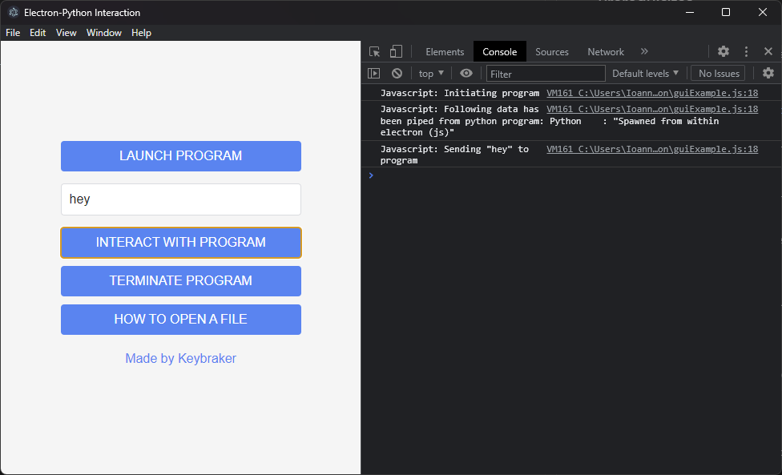

# Electron GUI for Python

A simple example on how to create an electron GUI for a python program and interacting with it.

## How does it work ( simple representation )

```text
electron
--------> |------------|    python
          |            |-------------> |-------------------|
          |  electron  |  sub process  | python program    |
          |  --------  |               | --------------    |
          |   > html   |      std      |  takes requests   |
          |   > css    | <-----------> |  from js and      |
          |   > js     | communication |  responds it,     |
          |            |               |  in the terminal  |
          |------------|               |-------------------|
```

Essentially no network is being created only one terminal is used when electron is launched and than from
within javascript ( electron ) a python program is initiated as a subprocess.
These two programs than communicate via standard streams.


## Prerequisites

Install Node.js and Python.

> ote that installation may be different for different operating systems

## Installation Guide

1. To download and install [electron](https://electron.atom.io) ( OS X or Linux ) you have to download it from [npm-electron](https://www.npmjs.com/package/electron) using :

   ```
   npm install electron --save-dev
   ```

   ```
   npm install -g electron
   ```

   ( if you don't have npm installed use this [link](https://nodejs.org/en/download/) to download it. )

2. Clone this repository:
   ```
   git clone https://github.com/keybraker/python-gui-electron.git
   ```

## Execution Guide

1. Open a terminal window and cd to cloned project

   ```
   cd python-gui-electron
   ```

2. Initialize the electron application (first-time)

   ```
   npm i
   ```

3. Run the electron application

   ```
   npm start
   ```

4. A page should spawn looking as follows:

